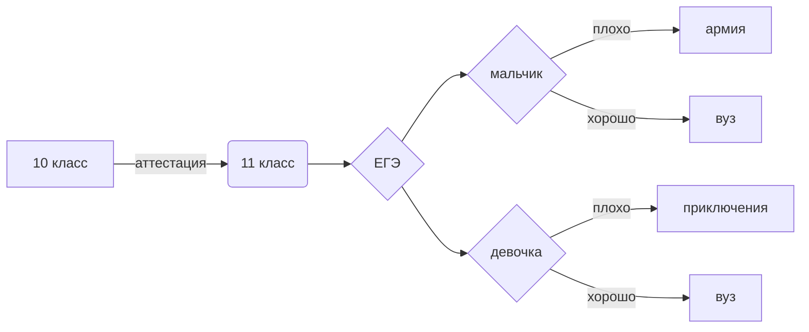

Nikita Davydov, group 122

My OpenProccessing profile: https://openprocessing.org/user/344085?view=activity&o=1

My CodePen profile: https://codepen.io/NikitaDavydov11

My Wordpress site: https://wordpress.com/post/github83.wordpress.com/6 

1. turtle(дерево).py-рисунок дерева в python

2. HammingCode.ipynb - Код Хемминга

3. morze.xlsx - Перевод кода Морзе

4. Книга1.xlsm - задания Excel

5. basadannih.py - база данных в Python

6. xyzw.py - Задание ЕГЭ таблица истинности

7. bool.xlsx - булева алгебра

8. Task1.py - перевод в другую систему счисления

9. Пер из 10 не в 10 - Перевод из десятичной СС в указанную

10. Task3.py - Таблица умножения

11. Снимок.PNG - Нейросеть

12. SQL.txt - база данных

13. Законы логики (закон Де Моргана 15 ) - 
$$\overline{A \wedge B} = \overline{A} \vee \overline{B}$$

14. $$\bar{E_0^{2}} = \sqrt[2]{\frac{F a_0^{2}}{(x-1)\cdot x } }+a_1^{2}+\beta_1^{2}$$

15. slidpopka.py - слайдшоу

16. victorinka.py - викторина

17. смайлик-армянин.PNG - смайлик

ЕГЭ по информатике

| Номер | Ответ |
| ------ | ------ |
| 1 | 58 |
| 2 | 45 |
| 3 | +|
| 4 | 14 |
| 5 | - |
| 6 | - |
| 7 | - |
| 8 | - |
| 9 | - |
| 10 | - |
| 11 | - |
| 12 | - |
| 13 | - |
| 14 | - |
| 15 | - |
| 16 | - |
| 17 | - |
| 18 | - |
| 19 | 64 |
| 20 | 32, 63 |
| 21 | 62 |
