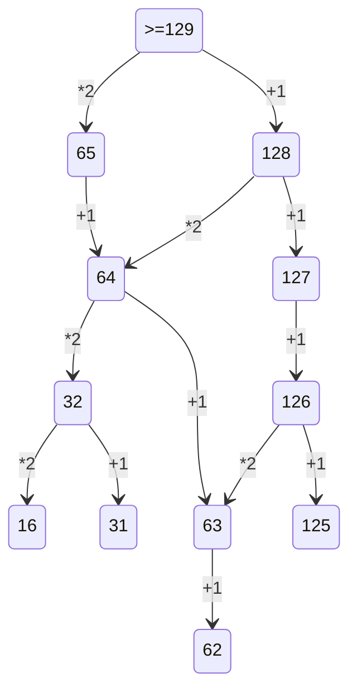

2 Задание: очень легко, просто запомнить логику

1)Сгенерировать все возможные сочетания переменных. много вложенных циклов

2)Проверить логическую функцию на условие, проверить её на ложь

3 Задание: фильтруй все столбцы таблицы.

10 Задание: Итак, для начала нажимаем ctrl+f, в word появляется расширенный поиск, где нужно указать нужные параметры поискаи далее нам покажет, сколько раз это слово встречается в данном файле.

4 Задание: Построить бинарное дерево с известными данными, определить кол-во нужных символом для кодировки, начать кодировку с минимального набора(кода), берем минимальный код(оставшихся вариантов хватает? Если нет, то увеличиваем длину кода.

13 Задание: 

19 Задание:

Нужно определить точку вход, условие ваыугрыша, сколько очков нужно набрать, чтобы завершить игру.

Рассписать двоичное дерево на 4 хода.

Ответить на вопрос задачи, присвоив какой ход, кто совершает.

