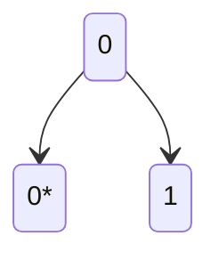
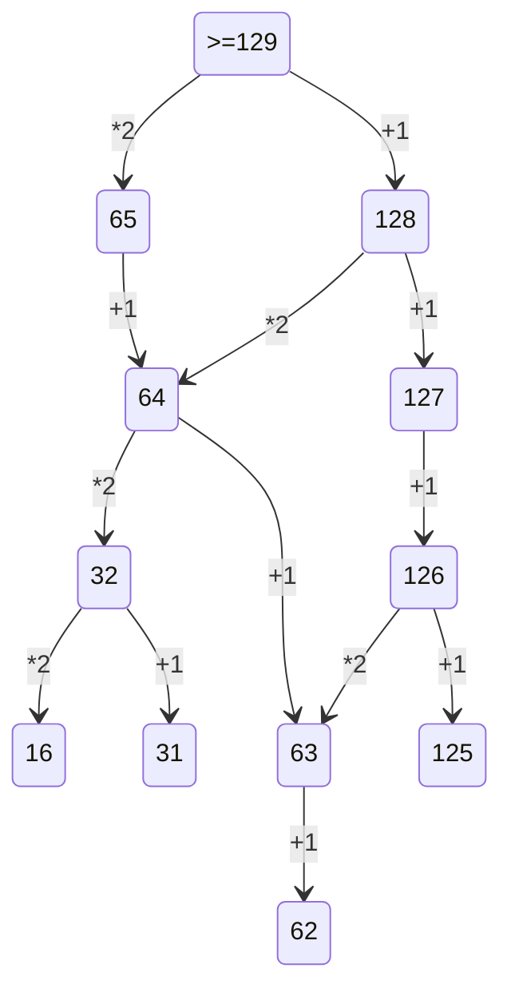

2 Задание: очень легко, просто запомнить логику

1)Сгенерировать все возможные сочетания переменных. много вложенных циклов

2)Проверить логическую функцию на условие, проверить её на ложь

3 Задание: фильтруй все столбцы таблицы.
применить фильтры по нужным значкениям
посчитать и умножить(при необходимости) на нужное количество

10 Задание: Итак, для начала нажимаем ctrl+f, в word появляется расширенный поиск, где нужно указать нужные параметры поискаи далее нам покажет, сколько раз это слово встречается в данном файле.

4 Задание: Построить бинарное дерево с известными данными, определить кол-во нужных символом для кодировки, начать кодировку с минимального набора(кода), берем минимальный код(оставшихся вариантов хватает? Если нет, то увеличиваем длину кода.
важно помнить про прямое условие фано - код одного символа не может быть началом кода другого символа

посмотреть, сколько раз встречается каждая буква
на основе данных условия задать для буквы, повторяющейся наибольшее количество раз, код с минимальным количеством знаков
далее по бинарному дереву выстроить значения для других букв

5 Задание:
в python для записи бинарного вида числа используется функция bin()
пишем в цикле все условия задачи

6 Задание:
на python нужно нарисовать то, что задано циклом, после чего(в данном случае) можно с помощью циклов расставить точки на рисунке и посчитать те, что оказались внутри фигуры
на кумире достаточно просто нарисовать фигуру, выставить масштаб таблицы 1:1 и посчитать пересечения линий клеток внутри фигуры

7 Задание:
вспомнить формулу для вычисления нужной величины
написать формулы для случаев "до" и "после"
определить изменение данной велимчины и получить то, что требуется

8 Задание: создать цикл по количеству знаков в числе
прописать условия в циклах

9 Задание: данную задачу можно сделать и в python, но в таблице легче

обозначить выполнение 1 условия
обозначить остальные условия на основе 1-го
посчитать одновременно удовлетворяющие обоим условиям клетки

10 Задание: 
Ctrl + F в параметрах ставим галочки "учитывать регистр" + "только слово целиком"
количество результатов будет показываться

13 Задание: 

19 Задание:

Нужно определить точку вход, условие ваыугрыша, сколько очков нужно набрать, чтобы завершить игру.

Рассписать двоичное дерево на 4 хода.

Ответить на вопрос задачи, присвоив какой ход, кто совершает.

